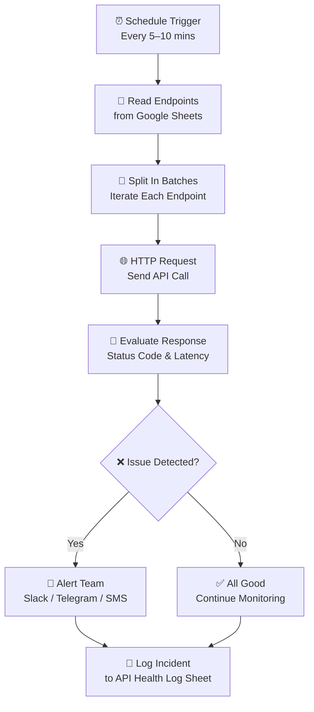

# 🩺 API Uptime Checker

A lightweight automation workflow that monitors API health, detects downtime or slow responses, and alerts your team instantly — before users complain.

---

## 🚀 Overview

API Uptime Checker helps teams stay proactive by:
- Monitoring endpoints every 5–10 minutes
- Validating status codes, latency, and payloads
- Sending real-time alerts via Slack, Telegram, Discord, or SMS
- Logging incidents in Google Sheets for tracking and resolution

---

## ❗ Problem Statement

Too often, teams discover broken APIs from user complaints. This workflow solves that by continuously checking endpoints and notifying the team before users are affected.

---

## ✅ Features

- Scheduled checks for uptime and latency
- Status code and payload validation
- Real-time alerts with endpoint details
- Incident logging with timestamps and resolution notes
- Easy integration with Google Sheets and messaging platforms

---

## 📊 Data Source

The workflow reads from a Google Sheet with the following columns:

| Column         | Description                                  |
|----------------|----------------------------------------------|
| URL            | Endpoint to monitor                          |
| Method         | HTTP method (GET, POST, etc.)                |
| Headers        | Optional request headers                     |
| ExpectedCode   | Expected HTTP status code (e.g., 200)        |
| MaxLatencyMs   | Maximum acceptable response time in ms       |

---

## 🔄 Workflow Steps

1. **Trigger** – Scheduled every 5–10 minutes
2. **Fetch List** – Read endpoints from Google Sheets
3. **Check** – Send HTTP request to each endpoint
4. **Evaluate** – Compare status code and latency
5. **Alert** – Notify team if any check fails
6. **Log** – Append incident to “API Health Log” sheet

---

## 📈 Workflow Map



---

## 🛠 Technologies Used

- **n8n** – Workflow automation engine
- **Google Sheets API** – Endpoint list and incident log
- **HTTP Request Node** – API health checks
- **Messaging Nodes** – Slack, Telegram, Discord, SMS

---

## 📦 Folder Structure
API-Uptime-Checker/  
│  
├── README.md # Project documentation  
├── workflow.json # n8n workflow export  
├── sample-data/  
│  └── endpoints-sheet.csv # Sample Google Sheet data  
├── assets/  
│  └── logo.svg # Optional branding asset  
├── docs/  
│  └── setup-guide.md # Detailed setup instructions  
   └── .gitignore # Git ignore rules

---

## 🧰 Setup Guide

### 1. Clone the Repository

```bash
git clone https://github.com/CryptoLab-service/API-Uptime-Checker.git
cd API-Uptime-Checker
```

### 2. Import Workflow into n8n

* Open your n8n instance
* Import workflow.json
* Review and activate the workflow

### 3. Configure Google Sheets
* Create a Google Sheet with the required columns
* Set up Google Sheets credentials in n8n
* Update the Sheet ID and tab name in the workflow

### 4. Set Up Messaging Alerts
* Choose your preferred alert channel (Slack, Telegram, etc.)
* Add credentials and configure the message nodes

### 5. Test and Deploy
* Run a manual test
* Activate the schedule trigger
* Monitor logs and alerts

---

# 👥 Contributors

| Name                   | Role                   | GitHub Handle         |
|------------------------|------------------------|-----------------------|
| Oluwalowo John         | Creator & Architect    | @oluwalowojohn        |
| CryptoLab-service      | Maintainer             | @CryptoLab-service    |

---

# 📄 License
This project is licensed under the MIT License. Feel free to fork, improve, and share.

---

# 🙌 Contribute
Pull requests are welcome! If you’d like to add new alert channels, improve payload validation, or build a dashboard, we’d love your input.
